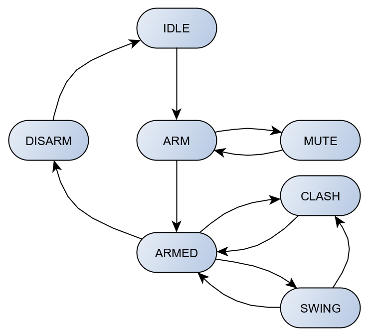
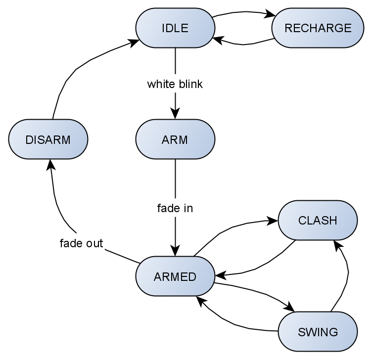
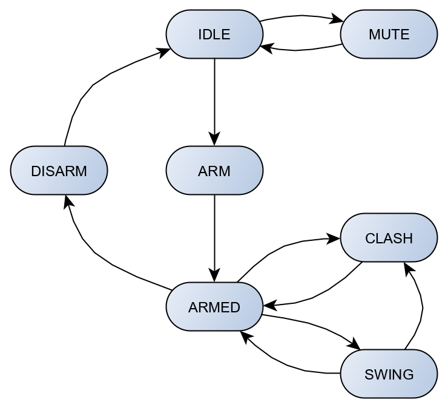

# Automaton

[Automaton](https://github.com/tinkerspy/Automaton/wiki) is a reactive state machine framework for Arduino.

The Automaton framework allows you to create Arduino applications that consist entirely of concurrently running components (finite state machines) interacting with one another.

Good knowledge of the framework is needed to contribute effectively to the code.

The main module of the saber FW are built using [Automaton template editor](http://wolkendek.nl/atm/).
Whit this page it's easy to change the machine behavior without making mistakes.

Some golden roules:
- Each state machine must have an IDLE state (first state).
- It's forbidden to store an instance of a Machine INSIDE of another Machine.
- All the machine interactions must be defined in the CoreEntryPoint.ino.
- It's better to have the same same for States and Events.
- If possible the state change shall be handled in the "internally handled event section" of the machine (e.g. with timers).

## State machine flowcharts
### Motion Module

### Led Module

### Audio Module
