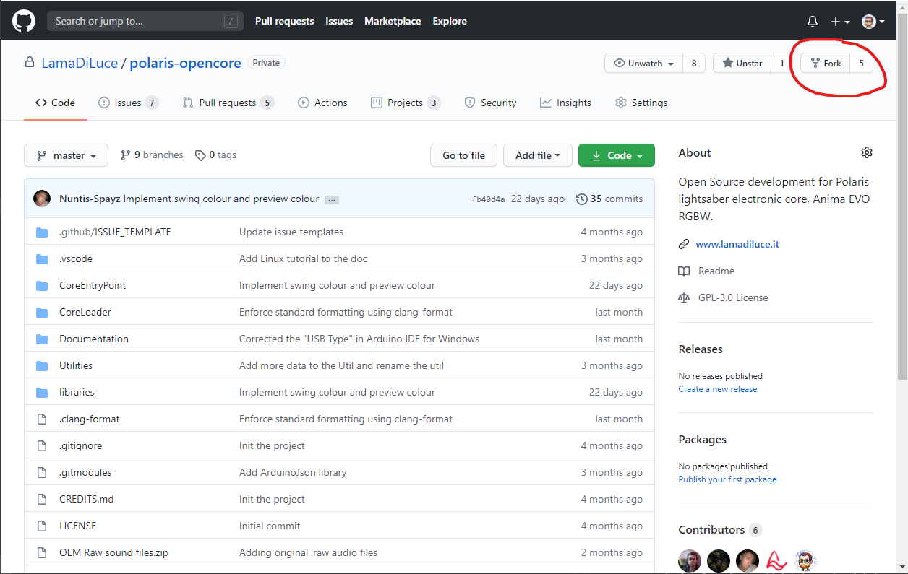
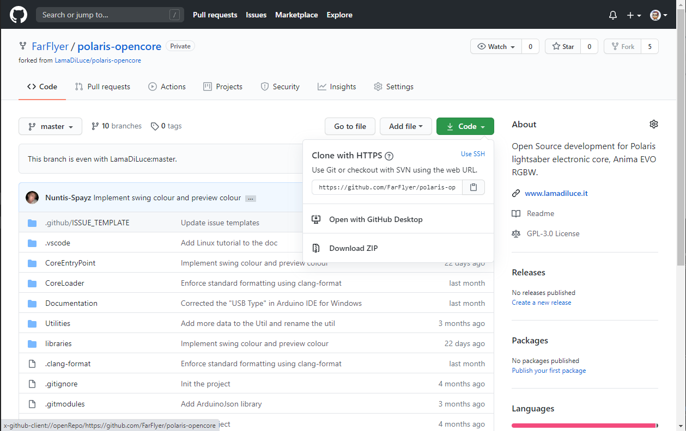
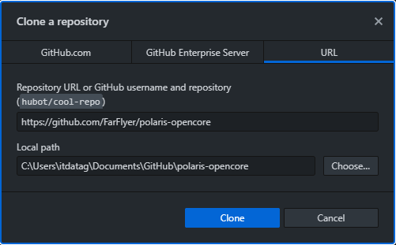

# Git setup
>Git is a VCS — Version Control System. It allows people to contribute on the same project at the same time without disturbing each other’s files.

>GitHub is a hosting service for Git Repositories.

The steps to be done in order to contribute to the project are:
1. You need to create a ***Fork*** of the polaris-opencore repository.
	- This can be done on the [polaris-opencore GitHub page](https://github.com/LamaDiLuce/polaris-opencore). Just press the ***Fork*** button on the top right.
2. You need to ***Clone*** your fork into a local folder.
3. [optional] You can create a ***Branch*** for your changes.
	- Creating a branch for a each specific feature is racommended.
4. When you are done with coding you can ***Commit*** your changes and send to the repository (*Push Origin*).
	- The changes are saved to GitHub.
5. Now you can create a ***Pull Request***.
	- The changes will be evaluated by the council members.

If you are not familiar with GIt and GitHub you can find online tons of guides for the above mentioned commands.

There follow a quick overview of the first steps for the different OS:
- [Windows setup](#windows-setup)
- [Linux setup](#linux-setup)

## Windows setup

If you are new to Git we racommand to use [GitHub Desktop](https://desktop.github.com/).

You can also  install the [Git bash](https://git-scm.com/download/win) too so you can perform git command in case of need.

1. Install [GitHub Desktop](https://desktop.github.com/)
2. Create a ***fork*** of the polaris-opencore repository on the [GitHub website](https://github.com/LamaDiLuce/polaris-opencore)

3. From your fork click on ***Code*** and select ***Open with GitHub Desktop***

4. From GitHub desktop select an empty folder for you local repository and click ***Clone***

5. If you are using VSCode (and you should), you can open it from GitHub Desktop with the related button on the home page or in the menu *Repository > Open in Visual Studio Code*
6. Now you can start coding on you local copy of the repository. You can *commit* you work and then, when finished, create a *pull request*.

## Linux setup

You can use Git from the command line but if you feel the need of a GUI client [SmartGit](https://www.syntevo.com/smartgit/) and [GitKraken](https://www.gitkraken.com/) are popular cross-platform options. To install Git using the **apt** package manager, enter the following commands in a terminal window:

1. Install Git:
    ```
    $ sudo apt update
    $ sudo apt install git
    ```
2. Verify installation (should output the version of the git package installed):
    ```
    $ sudo git --version
    ```
3. Create a *fork* of the polaris-opencore repository on the [GitHub website](https://github.com/LamaDiLuce/polaris-opencore)


4. Clone the project repository from the command line:
	```
    $ cd myWorkingDir
	$ git clone https://github.com/myGithubUser/polaris-opencore.git && cd polaris-opencore && git submodule update
    ```

5. Now you can start coding on you local copy of the repository. You can *commit* you work and then, when finished, create a *pull request*.