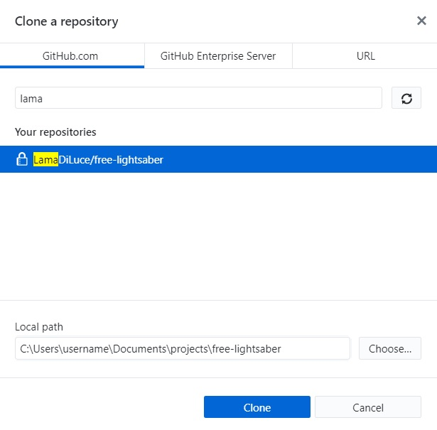
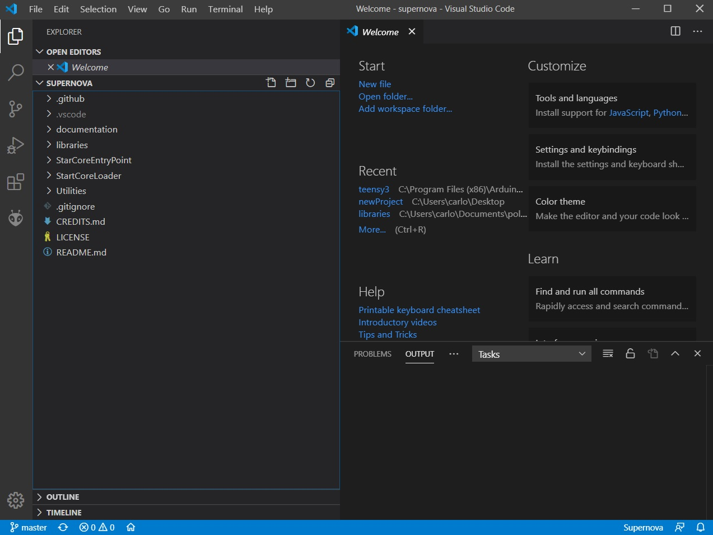
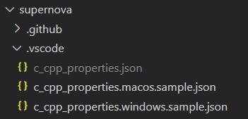
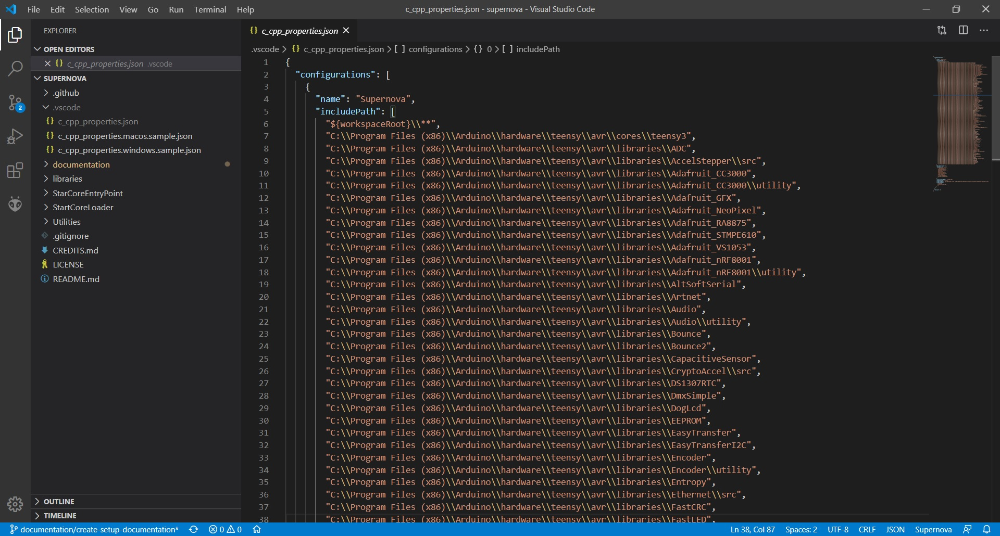
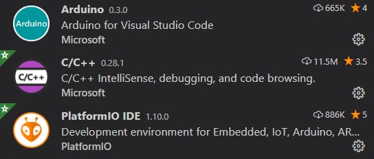

# Setup

## Windows setup

### IDE setup
We strongly advise using **Visual Studio Code**, which can be downloaded [here](https://code.visualstudio.com/). * 

### Git setup
You will need Git to contribute to this project. While the client is optional, if you are going to use **GitHub Desktop**, it is recommendable that you install the Git bash too so you can perform git command in case of need.

You can download the Git installer for Windows [here](https://git-scm.com/download/win). *

### GitHub Desktop setup (optional but recommended)
You can download the GitHub Desktop for Windows [here](https://desktop.github.com/).*

### Arduino setup

You can download Arduino for Windows directly from [here](https://www.arduino.cc/en/Main/Software). *

Please, make sure that you install the Arduino IDE from the **installer**. Not the **Windows App Store**.

### Teensyduino setup

You will also need to install **Teensyduino**, which can be downloaded [here](https://www.pjrc.com/teensy/td_download.html). *

*Just download and install the latest version for your Windows.

## Project configuration
### Cloning the repository
If you installed **GitHub Desktop**, you could directly clone the repository by going to "**File** > **Clone repository**" or by hitting "**Ctrl + Shift + O**".



### Visual Studio Code configuration

Once you have the repository cloned into your machine, we will open it with **Visual Studio Code**.

To do so, just open Visual Studio Code, go to "**File** > **Open Folder**" or just hit "**Ctrl + K**" or "**Ctrl + O**".

Then, look for the folder containing your local version of the repository.

You should have something like this:



The first thing that you need to do is to use your own **c_cpp_properties.json** file. In the folder **.vscode**, you will find two (2) demo files.

In this case, you want to duplicate the **c_cpp_properties.windows.sample.json** file and name it as **c_cpp_properties.json**.
Please, keep in mind that those json files are mere **boilerplate** files, so you might end-up replacing those with your **System setup configuration**.

You should end up having three (3) files under the **.vscode** folder:



As you can see, the **c_cpp_properties.json** file appears in "gray". That means that it is ignored by Git, as stated in the **.gitignore** file in the project. That means that you can make any modifications to that file that will not be affected by the code versions.



Once you are there, you will need some extensions that will help you with your codding.

To do so, you can click on "**View** > **Extensions**" or just hit "**Ctrl + Shift + X**".

Look for the **Arduino** Extension and the **C/C++** Extension. The extension **PlatformIO IDE** is not required, but you might end up installing that if you want to understand better how Arduino works.



Now you will need to download the **git submodule** libraries that this project needs. To do so go to **Terminal** > **New Terminal**. Make sure that you are on the project's root folder and then write:

```
git submodule update
```

Now you should be able to code without issues for the project.

### Arduino IDE configuration

Now we will set up the project in the **Arduino IDE** so that we can **Compile** / **Verify** and **Deploy** the project into the **Polaris**.

Just open the **Arduino IDE**.
Then go to "**File** > **Open**" or hit "**Ctrl + O**" and navigate to your **project folder** > **"CoreEntryPoint"** and open the file **CoreEntryPoint.ino**.

Now we need to configure the project so it actually can be built for our board.

Go to "**Tools**" and:

1. Set **Board** to "**Teensy 3.2 / 3.1**".
2. Set **USB Type** to "**USB**".
3. Set **CPU Speed** to "**72 Mhz**".
4. Set **Optimize** to "**Faster**".
5. Set **Keyboard Layout** to "**US English**".
6. If you have connected the **Polaris** to your computer via USB, you can also pick the **COM port** where it is connected on **Port**.

Now we need to gather the custom libraries that we are building in this project. 

Go to "**File** > **Preferences**" or hit "**Ctrl + ,**" and inside of Sketchbook location, place the location of your **project folder** and press **OK**.

Now, if you go to "**File** > **Sketchbook**", you should see "**CoreEntryPoint**" and "**CoreLoader**". That only means that the libraries are available for the compiler.

Now you can click on the "**Check**" symbol to **verify** the project by building it.

The first time you build the project, you will probably see warnings related to external libraries we are using. Don't mind those as they are only warnings and won't break the compilation.

Once you can see the message "**Done compiling**" you are good to go.

To push the code to your **Polaris**, you will need to press the "**Arrow**" symbol to **Upload** the code to the board. 

There will be a noise produced by your **Polaris** and your computer (disconnection and connection of a USB device sound) that indicates that the firmware has been uploaded to the **Polaris**.

## Linux setup

The following setup guide is intended for 64-bit Debian/Ubuntu based distros and has been tested on Ubuntu 20.04 and Linux Mint 19.3. Since most of the software is fetched straight from the Internet, it can be easily adapted for pretty much any other distro/package manager out there. 

### IDE Setup

No IDE is strictly enforced but **Visual Studio Code** is strongly recommended, being it accessible and cross-platform. You can download and install Visual Studio Code following one of the installation options described [here](https://code.visualstudio.com/docs/setup/linux).

### Git setup

You will need Git to contribute to this project. You can use Git from the command line but if you feel the need of a GUI client [SmartGit](https://www.syntevo.com/smartgit/) and [GitKraken](https://www.gitkraken.com/) are popular cross-platform options. To install Git using the **apt** package manager, enter the following commands in a terminal window:

1. Install Git:
    ```
    $ sudo apt update
    $ sudo apt install git
    ```
2. Verify installation (should output the version of the git package installed):
    ```
    $ sudo git --version
    ```
    
### Arduino IDE setup
You will need to install the **Arduino IDE** to compile and upload this project to your Anima EVO board.
1. Download the latest version of the Arduino IDE for Linux (1.8.12 at the time of writing) either from [here](http://www.arduino.cc/en/Main/Software) or using the command line:
    ```
    $ cd /tmp
    $ wget https://downloads.arduino.cc/arduino-1.8.12-linux64.tar.xz
    ```
2. Extract the Arduino IDE archive:
    ```
    $ tar -xvf arduino-1.8.12-linux64.tar.xz
    $ rm arduino-1.8.12-linux64.tar.xz
    ```
3. Install the Arduino IDE to a location of your choice (for the purpose of this guide the folder `~/.local/arduino-1.8.12/` will be used):
    ```
    $ mv arduino-1.8.12/ ~/.local/arduino-1.8.12/
    $ cd ~/.local/arduino-1.8.12/
    $ sudo ./install.sh 
    ```
4. Add your user to the **dialout** group so that it can access the serial ports to upload sketches:
    ```
    $ sudo usermod -a -G dialout $USER
    ```

### Teensyduino setup
To compile the project you will also need to install the **Teensyduino** software add-on for Arduino.
1. Set up a udev rule to give non-root users permission to use Teensy devices. Download and install the following [udev rule file](https://www.pjrc.com/teensy/49-teensy.rules) either manually or using the command line:
    ```
    $ wget https://www.pjrc.com/teensy/49-teensy.rules
    $ sudo cp 49-teensy.rules /etc/udev/rules.d/
    ```
2. Download and launch the latest version of the Teensyduino installer (1.52 at the time of writing) either from [here](https://www.pjrc.com/teensy/td_download.html) or using the command line:
    ```
    $ wget https://www.pjrc.com/teensy/td_152/TeensyduinoInstall.linux64
    $ chmod +x TeensyduinoInstall.linux64
    $ ./TeensyduinoInstall.linux64
    ```
3. Follow the installer instructions to complete the Teensyduino installation (you will be asked to select the Arduino IDE install location you chose earlier).

## Project configuration
### Cloning the repository
You can clone the project repository from the command line:
```
$ git clone https://github.com/LamaDiLuce/polaris-opencore.git && cd polaris-opencore && git submodule update
```
### Visual Studio Code configuration
Once you have a local copy of the repository on your machine, you can open the project in **Visual Studio Code** by simply typing `code .` from the project root folder:
```
$ cd polaris-opencore
$ code .
```
Then you can install the suggested VS Code extensions and configure the editor to start coding:
1. Install the **C/C++** and (optionally) **Platform.IO** extensions for VS Code as descibed in the [Windows setup guide](#visual-studio-code-configuration).
2. Install the boilerplate C/C++ configuration file for Linux. 
    * If you have chosen `~/.local/arduino-1.8.12/` as your Arduino IDE 1.8.12 installation folder, then the sample configuration file should work out-of-the-box. 
        ```
        $ cd .vscode
        $ cp c_cpp_properties.linux.sample.json c_cpp_properties.json
        ```
    * Otherwise, if you have installed the Arduino IDE to a different location or you are using a different version, you need to update your **c_cpp_properties.json** file to reflect your system configuration. Execute the following command substituting `<ARDUINO_INSTALL_DIR>` with the path to your Arduino installation folder.
        ```
        $ cd .vscode
        $ sed -e "s,~/.local/arduino-1.8.12,<ARDUINO_INSTALL_DIR>,g" c_cpp_properties.linux.sample.json c_cpp_properties.json
        ```

### Arduino IDE configuration
Follow these steps to **Compile** / **Verify** and **Deploy** the project into your **Polaris** using the **Arduino IDE**:
1. Open the project in the **Arduino IDE**:
    ```
    $ cd polaris-opencore
    $ arduino CoreEntryPoint/CoreEntryPoint.ino
    ```
2. Configure the project so it actually can be built for our board. Under the **Tools** menu:
    1. Set **Board** to "**Teensy 3.2 / 3.1**".
    2. Set **USB Type** to "**Serial**".
    3. Set **CPU Speed** to "**72 Mhz**".
    4. Set **Optimize** to "**Faster**".
    5. Set **Keyboard Layout** to "**US English**".
3. Gather the custom libraries that we are building in this project:
    1. Go to "**File** > **Preferences**" and in "**Sketchbook**" place the location of your **project folder**, then press **OK**.
    2. You can verify that the libraries are now made available for the compiler by going to "**File** > **Sketchbook**": you should see "**CoreEntryPoint**" and "**CoreLoader**".
4. You can **Compile** / **Verify** the project by clicking on the "**Check**" symbol. The first time you build the project, you will probably see warnings related to external libraries we are using. Don't mind those as they are only warnings and won't break the compilation. Once you can see the message "**Done compiling**" you are good to go.
5. To push the code to your **Polaris**:
    1. Connect the **Polaris** via USB.
    2. Pick the **serial port** to which the **Polaris** is connected by selecting it under "**Tools** > **Port**". It should be listed as something like "**/dev/ttyACM* (Teensy)**".
    3. Press the "**Arrow**" symbol to **Upload** the code to the board. 