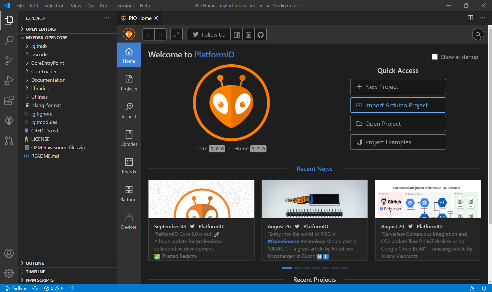
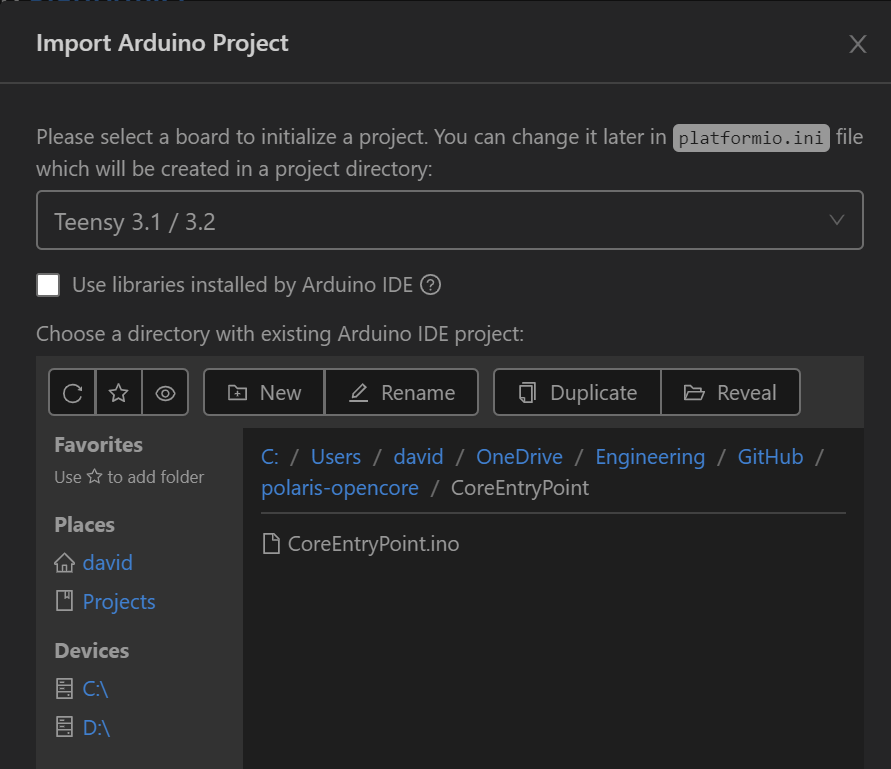
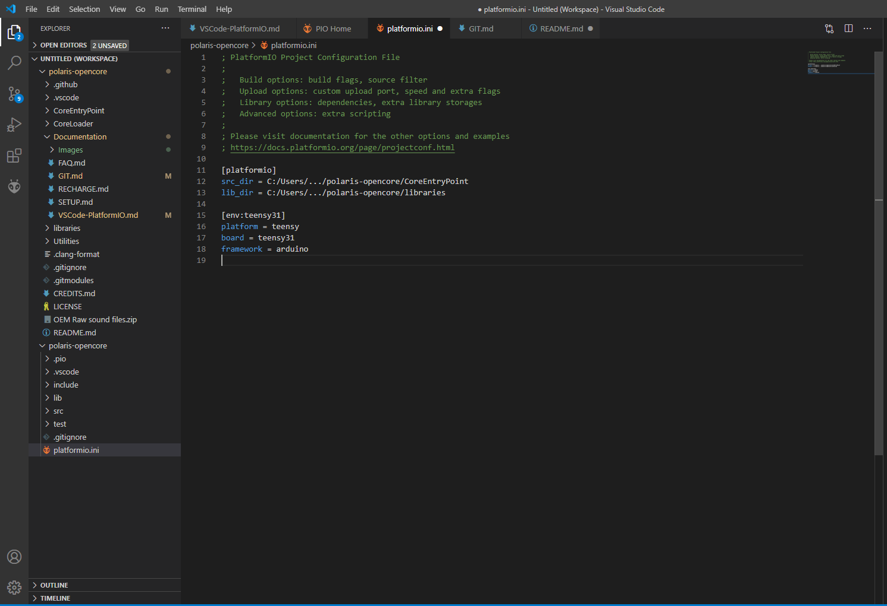

# Visual Studio Code plus PlatformIO extension
Visual Studio Code is a free source-code editor made by Microsoft for Windows, Linux and macOS. Features include support for debugging, syntax highlighting, intelligent code completion, snippets, code refactoring, and embedded Git.

You can download VS Code [here](https://code.visualstudio.com/).

Once you have the repository cloned into your machine (see [Git guide](Documentation/GIT.md)), open it with **Visual Studio Code**.

To do so, just open Visual Studio Code, go to *File > Open Folder* or you can open it from GitHub Desktop with the related button on the home page or in the menu *Repository > Open in Visual Studio Code*

Then, look for the folder containing your local version of the repository.

You should have something like this:

Once you are there, you will need PlatformIO extensions.

To do so, you can click on *View > Extensions*.

Look for the PlatformIO extension and install it.

After the installation you need to click on the *Import Arduino Project* on the PlatformIO home page.

In the import dialog you have to choose ***Teensy 3.1 / 3.2*** and you have to select the folder in you local copy of the repository which contains the *CoreEntryPoint.ino* file.

The PlatformIO extension will create a new project based on the selection.

You can see a new folder on the workspace on the right with a file called *platformio.ini*

Now you have to edit this file, adding a line to include the library folder of your local copy of the repository:
`lib_extra_dirs = C:/Users/yourusername/Documents/GitHub/polaris-opencore/libraries`

On the bottom bar of VS Code you can find the buttons to compile and upload the code to the saber.

You can save your workspace in order to open both the local copy of the repository and the PlatformIO project next time you want to work. VS Code will ask you to do so if you close the application.

