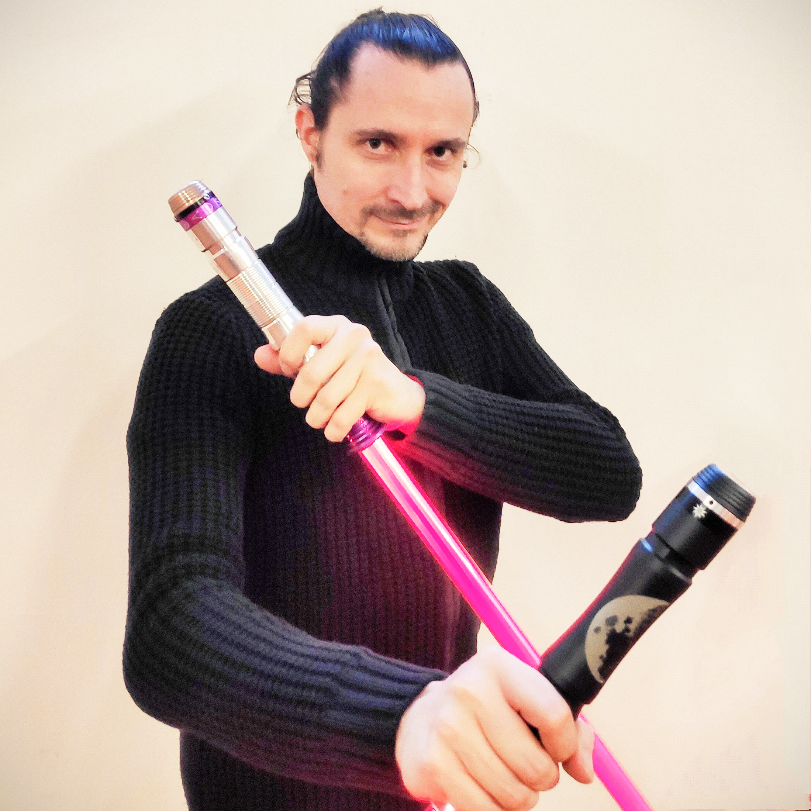
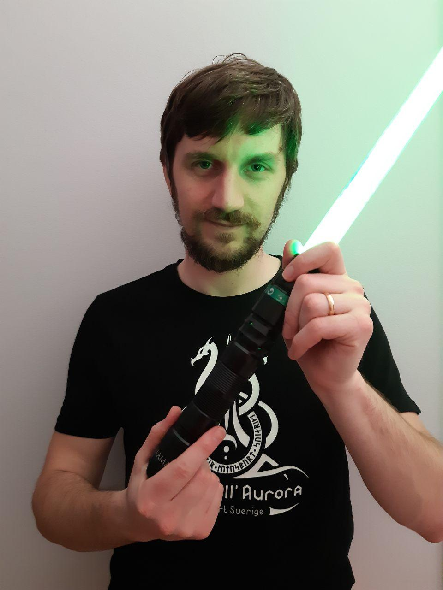
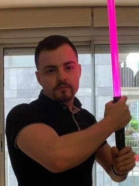
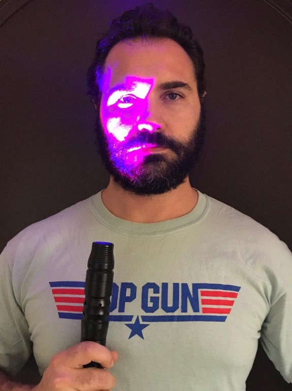
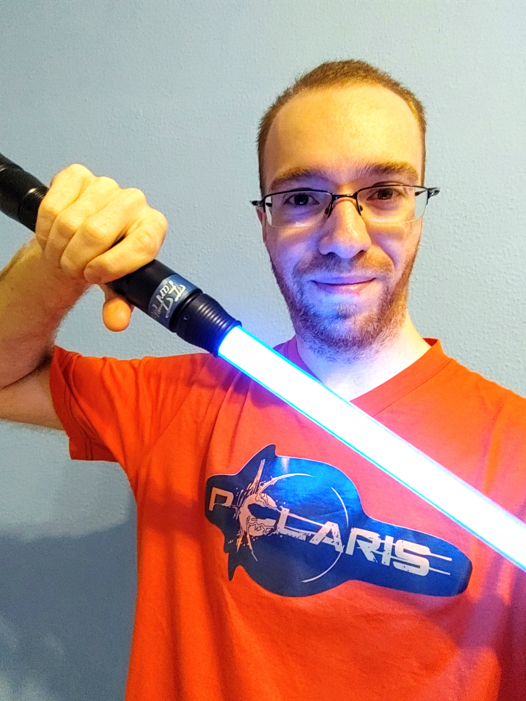
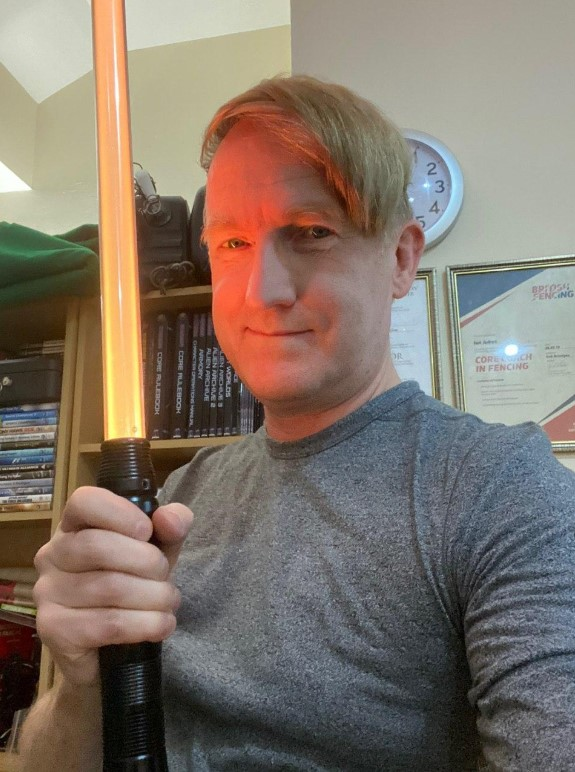

# LamaDiLuce - Anima EVO

Polaris, the combat ready modular hilt born in 2015 becomes an open source project in 2020 powered with the new Anima EVO electronic module.

To read the entire story you can follow [this link](https://www.lamadiluce.it/polaris-evo/).

---

## Table of contents
- [Introduction](#introduction)
- [Features](#features)
- [Setup](#setup)
- [Contributing](#contributing)
- [Coulcil members](#coulcil-members)
- [FAQ](#faq)
- [Donations](#donations)
- [License](#license)

---

## Introduction
[LudoSport](https://www.ludosport.net/) masters created in 2006 a combat discipline with the lightsaber that spread a common language among the people practicing it, however the athletes didn’t have a reference for their equipment yet.

In 2015 [LamaDiLuce](https://www.lamadiluce.it/) gave birth to Polaris, a new saber that would become the reference for hundreds of lightsaber enthusiasts who wanted to compete with an elegant weapon.

After 5 years, and after thousands of feedbacks from worldwide users, the new generation of saber is ready and you can contribute to the evolution of Polaris too.

---

## Features

- RGBW costomization for the LED
- No pushbutton required
  - Gestures to arm / disarm
  - Blade color can be selected among pre-sets during arming
  - Kill switch
- Mute cunction activated by a tap on the hilt during arming
- Electronic powered by a Cortex-M4
- Dedicated PC softwares for advanced customization and firmware upgrade

---

## Setup
In order to be able to contributre to this project, compile and upload the FW to your lightsaber, you need to:
- undestand C++
- be familiar with Arduino
- download and install a bunch of software
- get used to Git and GitHub in order to commit your changes

We strongly recommend to install VS Code and PlatformIO extension.

- [Get ready with GitHub](Documentation/GIT.md)
- [Configure VS Code plus PlatformIO](Documentation/VSCode-PlatformIO.md)

---

## Contributing
Any developer who wants to contribute to the project shall propose a completed merge into the master as a significant feature update for a release to the public (just one pull request with all the relevant details).

The changes are first reviewed in terms of coding, compatibility with previous versions and Scintilla SW. If the changes are ok and in line with the purpose of the lightsaber FW, the coulcil give the approval and a new release candidate is built.

This new release candidate is testes by selected developers and, if all the tests are passed, the master branch is updated and a new official FW version is released.

---

## Coulcil members
| Daniele *"dankenObi"* | Andrea *"AnFive"* | Carlos *"karldeux"* | Fabio | Davide "*FarFlyer"* | Ian *"Nuntis"* |
| :---: | :---: | :---: | :---: | :---: | :---: |
|  |  |  |  |   |  |

---

## FAQ
FAQ and troubleshooting can be found [here](Documentation/FAQ.md)

---

## Donations

You can still support the project with [development suggestions](https://bit.ly/Polaris-OpenCore-suggestion) or with a [free donation](https://www.paypal.me/ludosport/) that will be used for new hardware evolutions.

---

## License

---